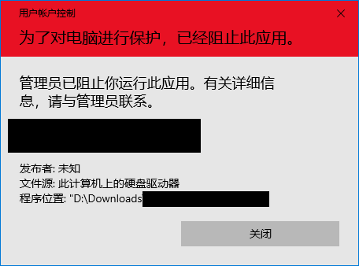

# PC软件代码签名证书限制工具 （适用于Windows）

## PC Software Code Signing Certificate Block Tool (Windows)

### 禁止未经允许自动安装和运行的软件、不受欢迎的软件屏蔽与企业应用安装控制策略工具

##### Block software installed and run automatically without permission, waste software shielding and enterprise application setup control tool

**众所周知，软件流氓推广几乎无处不在，让人防不胜防，您要没有火眼金睛或者稍有疏忽，各种全家桶绝对会让你抓狂。使用本工具，一劳永逸禁止电脑安装流氓软件，防止软件未经许可自动安装在您的电脑上。同时企业可以通过本工具控制禁用一些企业的软件被安装。本工具只适用于Windows。**

As we all know, software rogue promotion is almost everywhere, which is impossible to prevent. If you don't have golden eyes or a little negligence, all kinds of family buckets will definitely drive you crazy. Using this tool, it is forbidden to install rogue software on your computer once and for all, so as to prevent the software from automatically installing on your computer without permission. At the same time, enterprises can control and disable the installation of some enterprise software through this tool. This tool is only available for windows.

## 工具原理 / Principle

本工具通过在系统中吊销对应软件的证书，同时启用UAC认证，达到阻止某个组织软件运行的目的，本软件能够通过自定义镜像源进行自定义和批量屏蔽。

By revoking the certificate of the corresponding software in the system and enabling UAC authentication, the tool can prevent the software of an organization from running. The software can be customized and batch shielded through the user-defined image source.

## 使用限制 / Requirement

- #### Windows Vista 或者更高 (or highter)

- #### 能够打开UAC (Enable UAC)

- #### 软件有数字证书签名 (The software has a digital certificate signature)

## 使用方法 / Usage

- ### 禁用证书 / Block

- ### 恢复证书 / Unblock

## 屏蔽源 / Repositories

| 源名称                                          | 提供者 | 地域     | URL地址                                                                      |
| ----------------------------------------------- | ------ | -------- |----------------------------------------------------------------------------|
| Github直链 屏蔽中国大陆地区的一些不受欢迎的软件 | 皮卡丘 | 美国     | [点此访问](https://github.com/PIKACHUIM/BanCert/raw/master/certzip/cn-all.zip) |
| Coding直链 屏蔽中国大陆地区的一些不受欢迎的软件 | 皮卡丘 | 中国大陆 |                                                                            |

##### 提交源的方法：在本页面提交issue，并在标题最前端加上#屏蔽源#，例如#屏蔽源#收录了一些弹窗广告证书

## 默认列表 / Default Block List

| 被列为不信任的软件开发商 | 进入此列表的原因                       |
| ------------------------ | -------------------------------------- |
| 重庆重橙                 | FlashPlayer中国区推广广告              |
| 安徽沙巴克               | P2P下载器恶意安装流氓软件              |
| 160 驱动人生             | 篡改主页，篡改注册表，静默安装推广软件 |
| 功辉全部软件             | 双核浏览器涉嫌滥用用户隐私             |
| 上海展盟软件             | 弹窗广告                               |
| 南京晨曦软件             | 静默安装软件                           |
| 万能全部软件             | 静默安装软件                           |
| 2345软件                 | 静默安装软件                           |
| ...                      | ...                                    |

## 使用协议 / Agreement

## 特别感谢 / Thanks

**源码修改自@sharoue的chinawareblock，基于Python重新修改**
